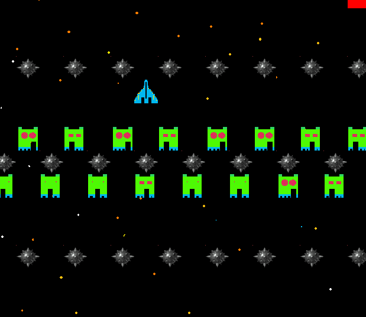
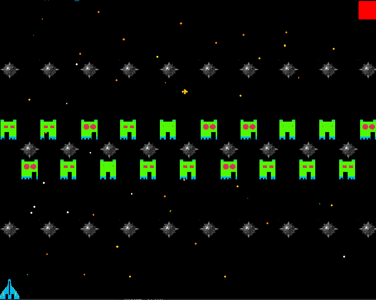

#  Solving a handcrafted scape game environment using Reinforcement Learning

Reinforcement Learning project using AIGym library /envs

## Game Rules and Goal

The world is a space grid of fixed size. The game goal is simple: take the blue ship to the red square

At each time step, the blue ship can :

- move left 
- move right
- move down
- move up
- do nothing

Some obstacles were design to make the game harder: 

 - The blue ship can't touch the green ghosts (more specific: they can't collide)
 - When the blue ship passes over a mine, there is a probability of 50% that it explodes
 - If the blue ship tries to go "through the walls" , the ship is also destroyed.

(if images don't render, click on them)

## AIGym game design

 The game is a typical sthocastic episodic game. 

- Reward is 1 if ship achieves the red square. 0 in all other cases
- Every scenario where the ship is hit or exploded is a final state (no additional lives)
- **Action space:** Discrete(5) => 0 (move left), 1 (move right), 2 (move down), 3 (move up), 4 (do nothing)
- **Observation Space:**  Discrete(*hw*) x Discrete(10) => first coordinate represent the position of the blue ship in the board of *h* of height and *w* of width, second coordinate represents the position of the ghost as a group

## Quick setut 

### Dependencies ( $ pip install [...])
 
 - pygame
 - gym
 - math
 - random
 - argparse

### How to run the game

   **$ python ScapeGame.py [...parameters]**

### Some parameters:

 - **--h** (*default=15, type=int*)                     => height of grid        
 - **--w** (*default=18, type=int*)                     => width of grid
 - **--step** (*default=1.0, type=int*)                 => The step given by the ghost per time step, mesure in grid cells
 - **--speed** (*default=10, type=int*)                 => Renderind speed (affects only human players)
 - **--block_size** (*default=40, type=int* )           => Control the pixel size of a grid squared cell 
 - **--free_play** (*default=False, type=bool*)         => Game don't restart automatically when ship is hit 
 - **--gameplay** (*default=0, type=int*)               => 0 is user interactive mode. Other modes refers to the gameplay of the trained agents   **(nothing here for the moment!!)**